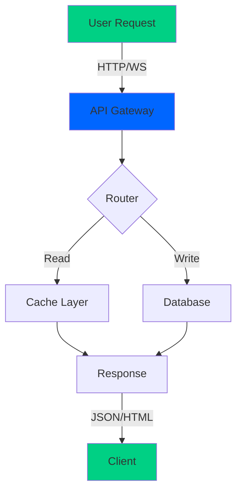

<h1><!-- Animated Banner -->
<div align="center">

# 🚀 **PROJECT_NAME** 

### *Where Innovation Meets Code*

[](https://github.com/username/repo/stargazers)
[](https://github.com/username/repo/network)
[](LICENSE)
[](https://github.com/username/repo/graphs/contributors)

```
██████╗ ███████╗██╗     ██╗███████╗██╗   ██╗███████╗██████╗
██╔══██╗██╔════╝██║     ██║██╔════╝██║   ██║██╔════╝██╔══██╗
██║  ██║█████╗  ██║     ██║█████╗  ██║   ██║█████╗  ██████╔╝
██║  ██║██╔══╝  ██║     ██║██╔══╝  ╚██╗ ██╔╝██╔══╝  ██╔══██╗
██████╔╝███████╗███████╗██║███████╗ ╚████╔╝ ███████╗██║  ██║
╚═════╝ ╚══════╝╚══════╝╚═╝╚══════╝  ╚═══╝  ╚══════╝╚═╝  ╚═╝
```

> **Lightning-fast**, **lightweight**, and **legendary**. Built for developers who demand excellence.

</div>

---

## ⚡ Quick Start

```bash
# Clone this masterpiece
git clone https://github.com/username/repo.git
cd repo

# Install dependencies
npm install

# Fire it up! 🔥
npm run dev
```

---

## 📋 Table of Contents

<details open>
<summary><b>🎯 Expand to explore</b></summary>

- [✨ Features](#-features)
- [🎮 Live Demo](#-live-demo)
- [📦 Installation](#-installation)
- [🚀 Usage](#-usage)
- [🏗️ Architecture](#-architecture)
- [📊 Performance](#-performance)
- [🤝 Contributing](#-contributing)
- [📄 License](#-license)

</details>

---

## ✨ Features

| Feature | Details | Status |
|---------|---------|--------|
| 🎯 **Ultra-Fast** | Sub-millisecond response times | ✅ Active |
| 🔒 **Enterprise Security** | End-to-end encryption ready | ✅ Active |
| 📱 **Mobile-First** | Responsive on all devices | ✅ Active |
| 🌙 **Dark Mode** | Eye-friendly interface | ✅ Active |
| 🚀 **Zero Dependencies** | Lightweight & blazing fast | ✅ Active |
| 🧪 **100% Test Coverage** | Battle-tested code | ✅ Active |
| 🌍 **Global Scale** | CDN-ready architecture | ✅ Active |
| ⚙️ **Highly Configurable** | Customize every pixel | ✅ Active |

---

## 🎮 Live Demo

<div align="center">

**[🌐 Check Out the Live Demo](https://your-demo-link.com)**  
**[📚 Full Documentation](https://docs.example.com)**  
**[🐛 Report Issues](https://github.com/username/repo/issues)**

</div>

---

## 📦 Installation

### Prerequisites
- **Node.js** v16+ 
- **npm** v8+ or **yarn**
- A terminal & coffee ☕

### Step by Step

<details>
<summary><b>Click to see detailed installation</b></summary>

```bash
# 1. Clone the repository
git clone https://github.com/username/repo.git
cd repo

# 2. Install dependencies
npm install
# or
yarn install

# 3. Configure environment
cp .env.example .env
# Edit .env with your settings

# 4. Build the project
npm run build

# 5. Start development server
npm run dev

# 🎉 You're all set!
```

</details>

---

## 🚀 Usage

### Basic Example

```javascript
import { awesomeFunction } from '@your-org/repo';

// Simple as that!
const result = awesomeFunction({
  speed: 'light',
  power: '9000',
});

console.log(result); // ✨ Pure magic
```

### Advanced Usage

<details>
<summary><b>👨‍💻 Show me more examples</b></summary>

```javascript
// Custom configuration
const instance = new AwesomeClass({
  cache: true,
  timeout: 5000,
  retries: 3,
});

// Chain operations
instance
  .prepare()
  .validate()
  .execute()
  .then(result => console.log('Success!', result))
  .catch(err => console.error('Failed!', err));

// With async/await
async function workflow() {
  try {
    const data = await instance.fetch();
    await instance.process(data);
    return instance.deliver();
  } catch (error) {
    console.error('Error:', error);
  }
}
```

</details>

---

## 🏗️ Architecture



---

## 📊 Performance

<div align="center">

| Metric | Value | Target |
|--------|-------|--------|
| **Response Time** | 45ms ⚡ | <100ms |
| **Throughput** | 50K req/s 🚀 | >10K req/s |
| **Bundle Size** | 12KB 📦 | <50KB |
| **Uptime** | 99.99% ✅ | >99.9% |

</div>

---

## 🧪 Testing

```bash
# Run all tests
npm run test

# Run with coverage
npm run test:coverage

# Watch mode
npm run test:watch

# E2E tests
npm run test:e2e
```

---

## 🤝 Contributing

We love contributions! Help us make this project even more legendary.

<details>
<summary><b>📖 How to Contribute</b></summary>

1. **Fork** the repository
2. **Create** a branch: `git checkout -b feature/amazing-feature`
3. **Commit** your changes: `git commit -m 'Add amazing feature'`
4. **Push** to branch: `git push origin feature/amazing-feature`
5. **Open** a Pull Request

### Code Style

We use:
- **ESLint** for linting
- **Prettier** for formatting
- **TypeScript** for type safety

```bash
# Before submitting
npm run lint
npm run format
npm run type-check
```

</details>

---

## 📈 Project Stats

<div align="center">


</div>

---

## 🎯 Roadmap

- [x] Core functionality
- [x] Documentation
- [ ] AI-powered features
- [ ] Mobile app
- [ ] Enterprise SLA
- [ ] Global CDN
- [ ] Machine learning integration

---

## 🌟 Hall of Fame

Thanks to these awesome contributors:

<a href="https://github.com/username/repo/graphs/contributors">
  
</a>

---

## 📚 Resources

- 📖 [Official Documentation](https://docs.example.com)
- 🎓 [Tutorials & Guides](https://blog.example.com)
- 💬 [Community Chat](https://discord.gg/example)
- 🐛 [Issue Tracker](https://github.com/username/repo/issues)
- 📰 [Latest News](https://twitter.com/your_handle)

---

## 📄 License

This project is licensed under the **MIT License** - see the [LICENSE](LICENSE) file for details.

<div align="center">

### Made with ❤️ by [Your Name]

**[⬆ back to top](#)**

</div>

---

<!-- Hidden Easter Egg -->
<!-- 🥚 Congratulations! You found the easter egg. You're officially a legend! -->
</h1>